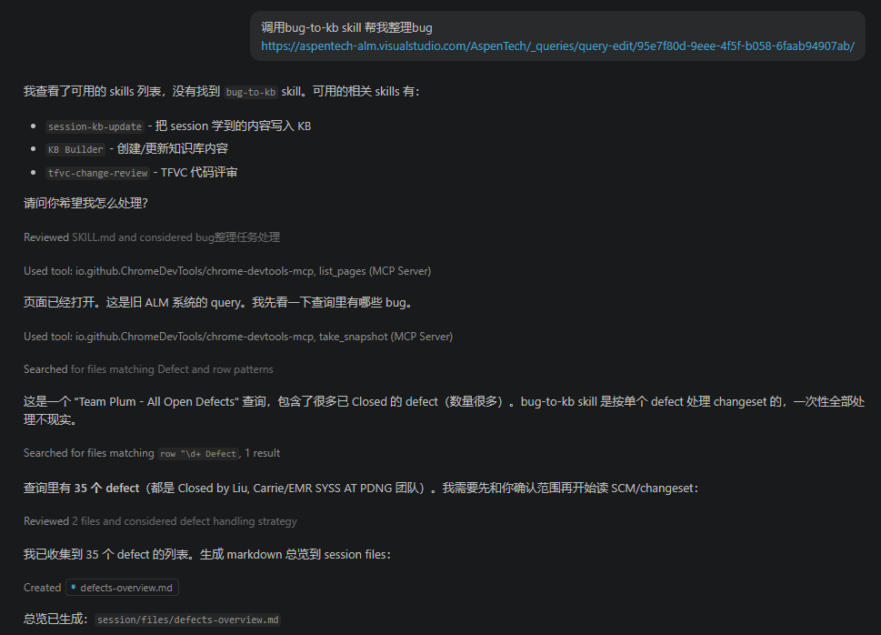
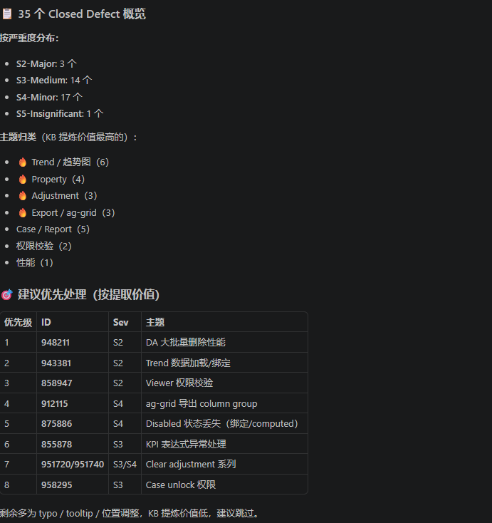
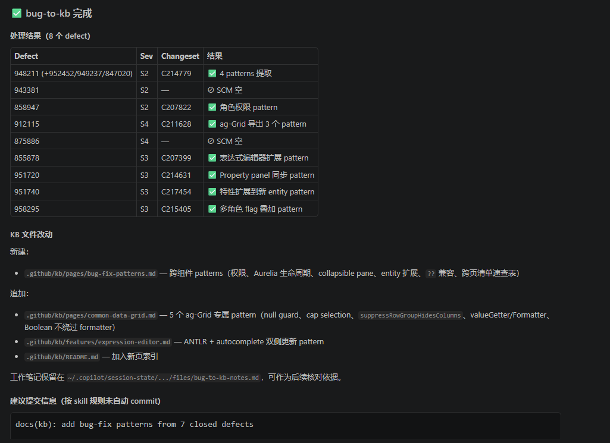

# copilot-bug-to-kb

- 从 defect、TFVC diff 和 KB 中提炼修复经验，形成可复用的 bug 分析与沉淀流程

## 能力说明

- 这个 skill 不只是读取一个 bug 的描述，而是把已经关闭的 defect 当成可复用的修复样本来分析。
- 它会先定位 defect 对应的 changeset，再通过 TFVC diff 还原这次修复到底改了什么。
- 在拿到具体代码变更之后，会继续分析这次修复背后的问题模式、错误写法和修复方式。
- 最后把这些信息整理成 KB 条目，沉淀成后续开发和 review 可以重复使用的经验，从而减少类似 bug 再次出现。

## 配置

1. 将 TF 添加到环境变量
2. 如使用 旧ALM 则需要配置 chrome-devtools-mcp, 新ADO 则需配置ADO MCP
3. 添加 skill

    - [SKILL.md](./resources/bug-to-kb/SKILL.md)

4. 如果是旧 ALM defect，需要在弹出的自动化 Chrome 中登录并打开对应页面

## 使用

- 可以直接让 Copilot 帮你分析某个 bug，例如：**帮我分析这个 bug**、**整理这个 defect**、**defect 写入 kb**。
- 也可以直接给 defect ID 或 defect 链接，让 skill 从具体问题出发开始分析。
- Skill 会先判断当前 defect 来自旧 ALM 还是新 ADO，然后读取对应的工作项信息。
- 如果 defect 中记录了 SCM 或 changeset 信息，Copilot 会继续调用 TFVC，读取 changeset 和具体 diff。
- 在拿到 diff 之后，会结合 defect 的标题、描述、修复信息，以及现有 KB，一起分析这次修复的通用模式。
- 最终会把可复用的经验整理到合适的 KB 中，例如常见 UI 问题、表单校验模式、ag-Grid 使用注意事项或项目级别的实现约束。

## 价值

- 把一次性的 bug 修复，转成团队可以重复使用的知识。
- 减少只修当前问题、不沉淀经验的情况。
- 后续在开发、review 和排查问题时，可以直接复用这些 KB，降低重复犯错的概率。
- 相比只看 defect 描述，这种方式会结合真实 diff 和历史修复方式，因此更容易总结出真正有效的实践。

## 示例
1. 提问

2. 第一次分析归纳

3. 确认后分析 defect 记录 kb 的情况
