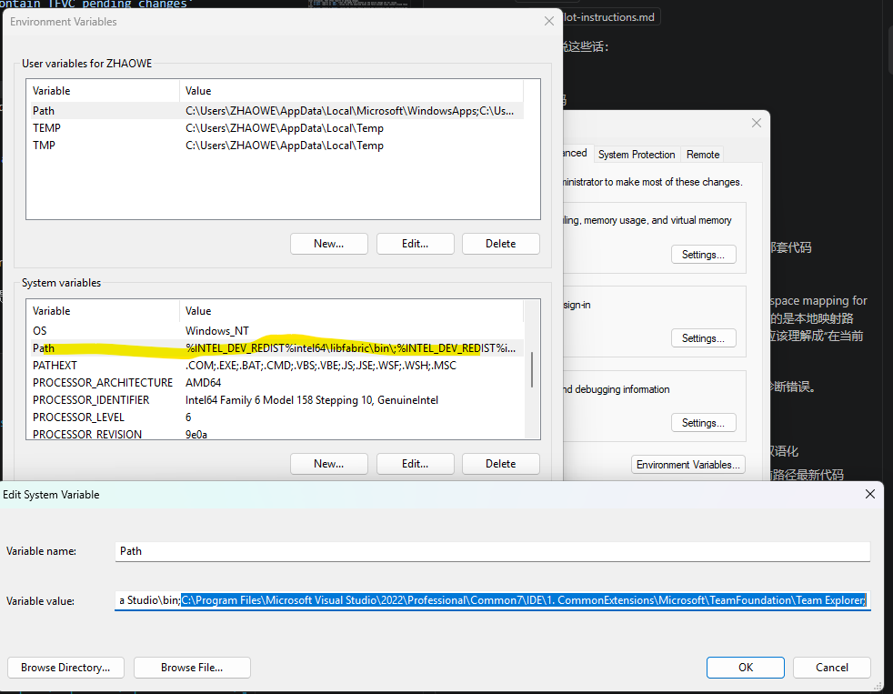
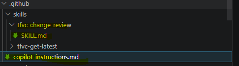
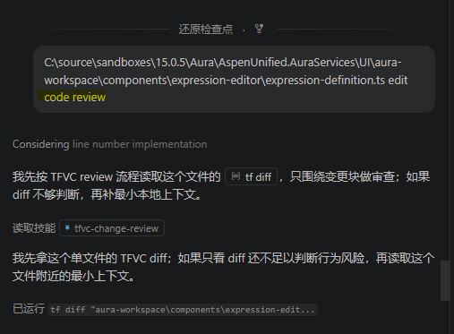
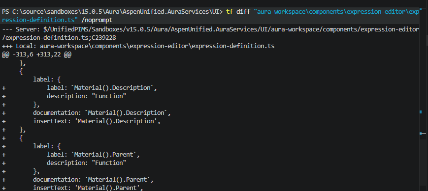

# copilot-review-diff

- 结合 VS、TF diff、ADO 上下文和 KB 的更精确 code review

## 能力升级

- 在拿到 TFVC diff 之后，不再只基于代码变更本身进行 review。
- 工具会进一步尝试识别并获取相关的 ADO 链接，例如 User Story、Bug、Test Case 等工作项。
- 在获取这些工作项的关键信息后，再结合现有 KB 一起进行 review，从需求背景、缺陷场景、测试覆盖和历史经验多个维度给出更有针对性的建议。
- 这样可以减少只看 diff 带来的上下文缺失问题，更有效地提前发现潜在 bug。

## 配置

1. 将TF 添加到环境变量

    

2. 添加skill

    

    - [SKILL.md](./resources/tfvc-change-review/SKILL.md)
    - [copilot-instructions.md](./resources/tfvc-change-review/copilot-instructions.md)

## 使用

- 需要review的path(支持一次性多个) **review code** (prompt)
    
- Copilot 会先读取具体的 TFVC diff，定位本次改动的核心内容。
- 在拿到 diff 之后，还会进一步分析是否存在相关的 ADO 链接，例如 User Story、Bug、Test Case 等。
- 如果识别到相关链接，会继续读取这些工作项中的关键信息，并结合团队 KB 一起做 review。
- 最终得到的 review 不仅基于代码差异，也会参考需求背景、缺陷历史、测试信息和已有经验，因此更容易发现遗漏和潜在风险。
    
