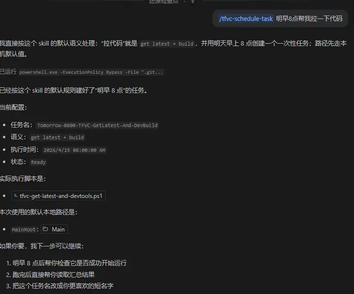

# TFVC Schedule Task
- 结合schedule task, 可以让copilot帮你定时执行某些脚本，比如拉代码

## 资源

- [skill](resources\tfvc-schedule-task\SKILL.md)
- [注册Schedule Task](resources\tfvc-schedule-task\register-tfvc-scheduled-task.ps1)
- [拉代码build脚本](resources\tfvc-schedule-task\tfvc-get-latest-and-devtools.ps1)

## steps 
1. 调用skill 帮我创建

2. schedule task 创建成功

3. 自动执行  tf get 以及 TfsBuild dev, 并自动打开执行结果 的 .txt 

也可以 schedule 比如每周一早上8点帮我拉代码， 可以节省很多时间，如果执行失败也可以让copilot 分析原因等等
 
也可以拓展更多的  脚本
 