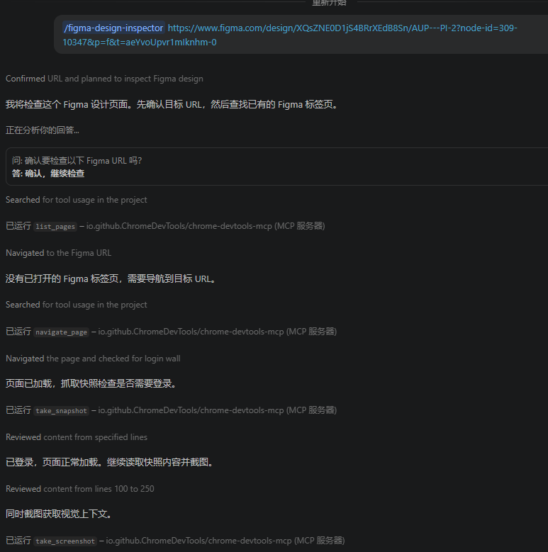
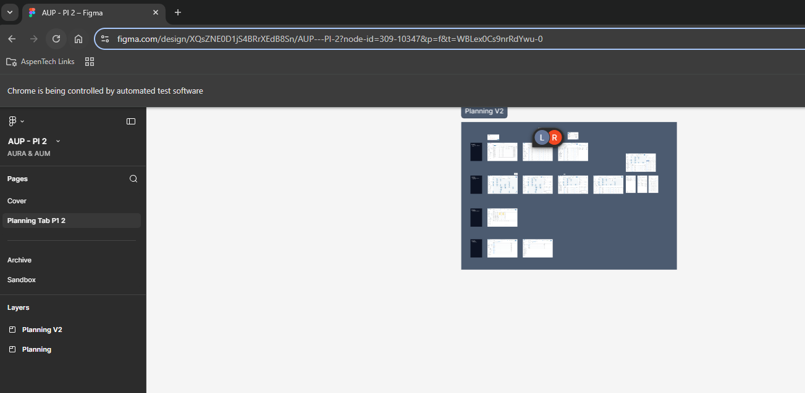
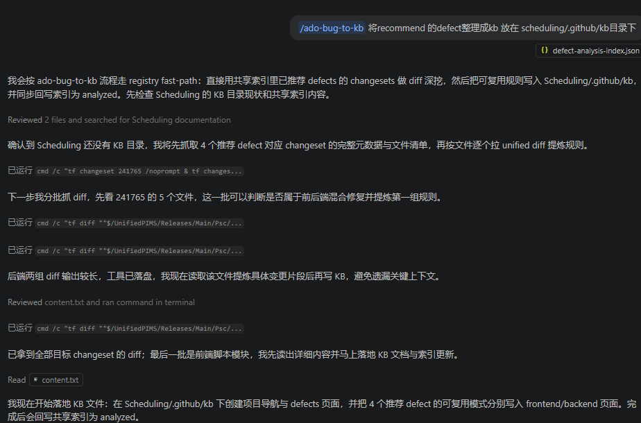
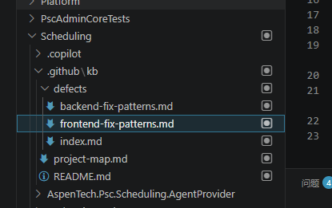

# AI use case sharing

## figma mcp 替代 chrome-devtools mcp

1. [chrome-devtools mcp](./resources/chromeDevTools/mcp.json)
2. [figma-design-inspector skill](./resources/figma-design-inspector/SKILL.md)

### 示例
1. 指定查看某个figma url
    
2. chrome 自动打开后登录
    
3. 自动抓取figma 相关信息
    - 可以点击present 查看
    - 可以点击左侧 pages layers  收集右侧panel comments properties 等信息

### 作用

    - 让copilot 自己去抓 figma 可以节省一点我们自己的描述， 也可以 当我们觉得信息获取足够之后让 copilot 自己去实现

## bug kb pipeline

### 依赖

1. [TFVC Defect Scan Skill](./resources//TFVC%20Defect%20Scan/SKILL.md)
2. [ADO bug to kb](./resources/ado-bug-to-kb/SKILL.md)

### 实现

>我们有两条路线 从 TF -> ado ， 也可以 从 ADO -> TF, 由于 新ado bug 没有记录change set 所以采用 1
1. 调用TFVC Defect Scan Skill


    
    - 生成defect-analysis-index.json
    ```json
    {
        "schemaVersion": 2,
        "lastUpdated": "2026-05-19T00:00:00+08:00",
        "generatedBy": [
            "tfvc-defect-scan"
        ],
        "scopes": {
            "Psc/Scheduling": {
            "scopeKey": "Psc/Scheduling",
            "lastScanStartChangeset": "latest",
            "lastScanDepth": 10,
            "lastScanAt": "2026-05-19T00:00:00+08:00",
            "lastRecommendedDefects": [
                95415,
                102167,
                105951,
                105456
            ]
            }
        },
        "defects": {
            "92010": {
            "id": 92010,
            "scopeKey": "Psc/Scheduling",
            "analysisStatus": "new",
            "changesets": [
                241739
            ],
            "kbRefs": [],
            "kbScope": "project",
            "promotionCandidate": false,
            "lastSeenInScope": "Psc/Scheduling",
            "lastSeenChangeset": 241739
            },
            "95415": {
            "id": 95415,
            "scopeKey": "Psc/Scheduling",
            "analysisStatus": "recommended",
            "changesets": [
                241765
            ],
            "kbRefs": [],
            "kbScope": "project",
            "promotionCandidate": false,
            "lastSeenInScope": "Psc/Scheduling",
            "lastSeenChangeset": 241765,
            "recommendedBy": [
                "tfvc-defect-scan"
            ],
            "recommendedAt": "2026-05-19T00:00:00+08:00"
            },
            "102167": {
            "id": 102167,
            "scopeKey": "Psc/Scheduling",
            "analysisStatus": "recommended",
            "changesets": [
                241756
            ],
            "kbRefs": [],
            "kbScope": "project",
            "promotionCandidate": false,
            "lastSeenInScope": "Psc/Scheduling",
            "lastSeenChangeset": 241756,
            "recommendedBy": [
                "tfvc-defect-scan"
            ],
            "recommendedAt": "2026-05-19T00:00:00+08:00"
            },
            "105107": {
            "id": 105107,
            "scopeKey": "Psc/Scheduling",
            "analysisStatus": "new",
            "changesets": [
                241729
            ],
            "kbRefs": [],
            "kbScope": "project",
            "promotionCandidate": false,
            "lastSeenInScope": "Psc/Scheduling",
            "lastSeenChangeset": 241729
            },
            "105456": {
            "id": 105456,
            "scopeKey": "Psc/Scheduling",
            "analysisStatus": "recommended",
            "changesets": [
                241727
            ],
            "kbRefs": [],
            "kbScope": "project",
            "promotionCandidate": false,
            "lastSeenInScope": "Psc/Scheduling",
            "lastSeenChangeset": 241727,
            "recommendedBy": [
                "tfvc-defect-scan"
            ],
            "recommendedAt": "2026-05-19T00:00:00+08:00"
            },
            "105461": {
            "id": 105461,
            "scopeKey": "Psc/Scheduling",
            "analysisStatus": "new",
            "changesets": [
                241727
            ],
            "kbRefs": [],
            "kbScope": "project",
            "promotionCandidate": false,
            "lastSeenInScope": "Psc/Scheduling",
            "lastSeenChangeset": 241727
            },
            "105488": {
            "id": 105488,
            "scopeKey": "Psc/Scheduling",
            "analysisStatus": "new",
            "changesets": [
                241727
            ],
            "kbRefs": [],
            "kbScope": "project",
            "promotionCandidate": false,
            "lastSeenInScope": "Psc/Scheduling",
            "lastSeenChangeset": 241727
            },
            "105951": {
            "id": 105951,
            "scopeKey": "Psc/Scheduling",
            "analysisStatus": "recommended",
            "changesets": [
                241741
            ],
            "kbRefs": [],
            "kbScope": "project",
            "promotionCandidate": false,
            "lastSeenInScope": "Psc/Scheduling",
            "lastSeenChangeset": 241741,
            "recommendedBy": [
                "tfvc-defect-scan"
            ],
            "recommendedAt": "2026-05-19T00:00:00+08:00"
            }
        }
        }

    ```

    - 得到一定的建议
    

2. 继续 to kb



- 生成的kb defect 部分



3. [code review skill](./resources/tfvc-change-review/SKILL.md) 使用这个kb 


